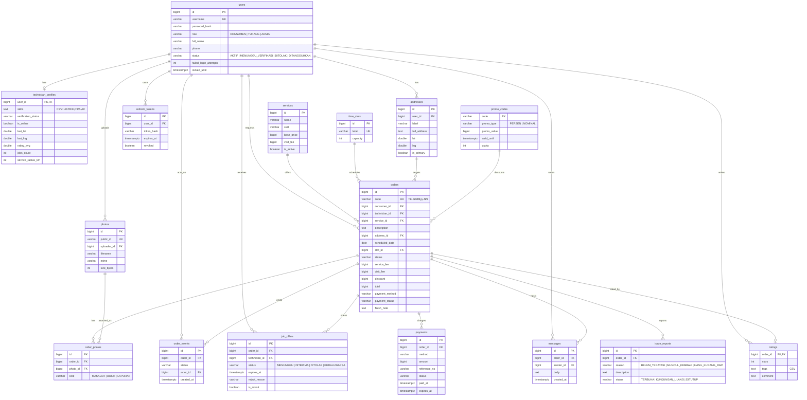

# ERD Tukang Kilat

```mermaid
erDiagram
    users ||--o| technician_profiles : "has"
    users ||--o{ addresses : "has"
    users ||--o{ orders : "requests"
    users ||--o{ job_offers : "receives"
    users ||--o{ refresh_tokens : "owns"
    users ||--o{ order_events : "acts_on"
    users ||--o{ messages : "sends"
    users ||--o{ ratings : "writes"
    users ||--o{ photos : "uploads"

    services ||--o{ orders : "offers"
    time_slots ||--o{ orders : "schedules"
    addresses ||--o{ orders : "targets"

    orders ||--o{ order_photos : "has"
    orders ||--o{ order_events : "emits"
    orders ||--o{ job_offers : "opens"
    orders ||--o{ payments : "charges"
    orders ||--o{ messages : "hosts"
    orders ||--o{ issue_reports : "reports"
    orders ||--o| ratings : "rated_by"

    photos ||--o{ order_photos : "attached_as"

    promo_codes ||--o{ orders : "discounts"

    users {
        bigint id PK
        varchar username UK
        varchar password_hash
        varchar role "KONSUMEN | TUKANG | ADMIN"
        varchar full_name
        varchar phone
        varchar status "AKTIF | MENUNGGU_VERIFIKASI | DITOLAK | DITANGGUHKAN"
        int failed_login_attempts
        timestamptz locked_until
    }

    technician_profiles {
        bigint user_id PK, FK
        text skills "CSV: LISTRIK,PIPA,AC"
        varchar verification_status
        boolean is_online
        double last_lat
        double last_lng
        double rating_avg
        int jobs_count
        int service_radius_km
    }

    addresses {
        bigint id PK
        bigint user_id FK
        varchar label
        text full_address
        double lat
        double lng
        boolean is_primary
    }

    services {
        bigint id PK
        varchar name
        varchar skill
        bigint base_price
        bigint visit_fee
        boolean is_active
    }

    time_slots {
        bigint id PK
        varchar label UK
        int capacity
    }

    promo_codes {
        varchar code PK
        varchar promo_type "PERSEN | NOMINAL"
        bigint promo_value
        timestamptz valid_until
        int quota
    }

    orders {
        bigint id PK
        varchar code UK "TK-ddMMyy-NN"
        bigint consumer_id FK
        bigint technician_id FK
        bigint service_id FK
        text description
        bigint address_id FK
        date scheduled_date
        bigint slot_id FK
        varchar status
        bigint service_fee
        bigint visit_fee
        bigint discount
        bigint total
        varchar payment_method
        varchar payment_status
        text finish_note
    }

    order_photos {
        bigint id PK
        bigint order_id FK
        bigint photo_id FK
        varchar kind "MASALAH | BUKTI | LAPORAN"
    }

    photos {
        bigint id PK
        varchar public_id UK
        bigint uploader_id FK
        varchar filename
        varchar mime
        int size_bytes
    }

    order_events {
        bigint id PK
        bigint order_id FK
        varchar status
        bigint actor_id FK
        timestamptz created_at
    }

    job_offers {
        bigint id PK
        bigint order_id FK
        bigint technician_id FK
        varchar status "MENUNGGU | DITERIMA | DITOLAK | KEDALUWARSA"
        timestamptz expires_at
        varchar reject_reason
        boolean is_revisit
    }

    payments {
        bigint id PK
        bigint order_id FK
        varchar method
        bigint amount
        varchar reference_no
        varchar status
        timestamptz paid_at
        timestamptz expires_at
    }

    ratings {
        bigint order_id PK, FK
        int stars
        text tags "CSV"
        text comment
    }

    issue_reports {
        bigint id PK
        bigint order_id FK
        varchar reason "BELUM_TERATASI | MUNCUL_KEMBALI | HASIL_KURANG_RAPI"
        text description
        varchar status "TERBUKA | KUNJUNGAN_ULANG | DITUTUP"
    }

    messages {
        bigint id PK
        bigint order_id FK
        bigint sender_id FK
        text body
        timestamptz created_at
    }

    refresh_tokens {
        bigint id PK
        bigint user_id FK
        varchar token_hash
        timestamptz expires_at
        boolean revoked
    }
```
